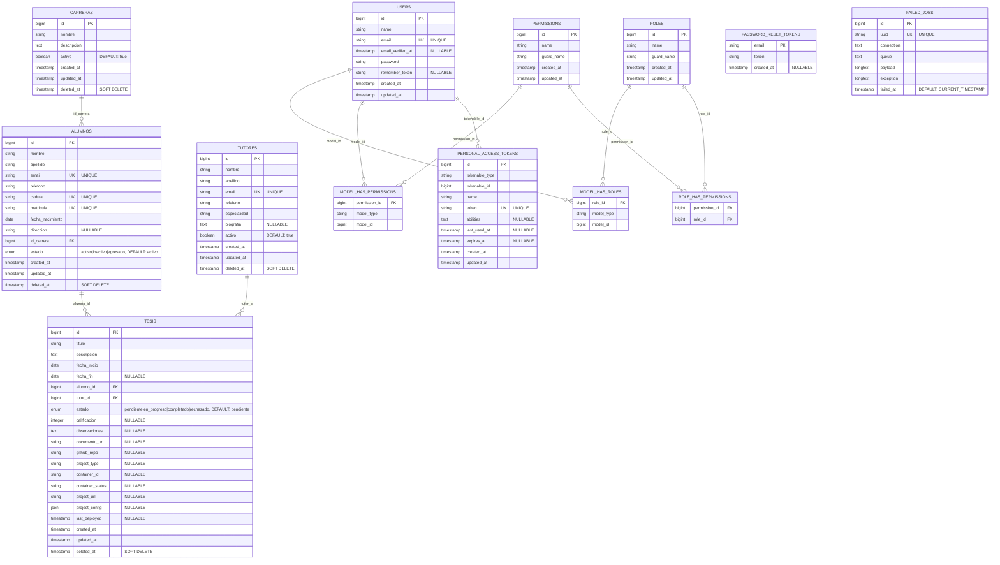

# 🏗️ DIAGRAMA DE BASE DE DATOS - SISTEMA DE TESIS

## 📊 **DIAGRAMA ENTIDAD-RELACIÓN (ERD)**



## 🔍 **DETALLES DE RELACIONES**

### 🎯 **Relaciones Principales (1:N)**
- **CARRERAS** → **ALUMNOS**: Una carrera puede tener muchos alumnos
- **ALUMNOS** → **TESIS**: Un alumno puede tener muchas tesis
- **TUTORES** → **TESIS**: Un tutor puede dirigir muchas tesis

### 🔐 **Sistema de Permisos (Spatie Laravel-Permission)**
- **USERS** ↔ **ROLES**: Relación Many-to-Many (a través de model_has_roles)
- **USERS** ↔ **PERMISSIONS**: Relación Many-to-Many (a través de model_has_permissions)
- **ROLES** ↔ **PERMISSIONS**: Relación Many-to-Many (a través de role_has_permissions)

### 🚀 **Funcionalidades Docker/Proyectos**
- Campos en **TESIS** para gestión de proyectos:
  - `github_repo`: URL del repositorio
  - `project_type`: Tipo de proyecto (Laravel, Java, etc.)
  - `container_id`: ID del contenedor Docker
  - `container_status`: Estado del contenedor
  - `project_url`: URL de acceso al proyecto desplegado
  - `project_config`: Configuración en JSON
  - `last_deployed`: Fecha del último despliegue
```
