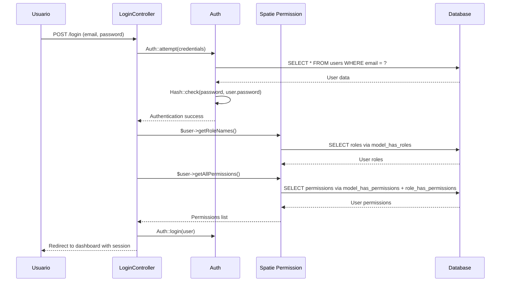
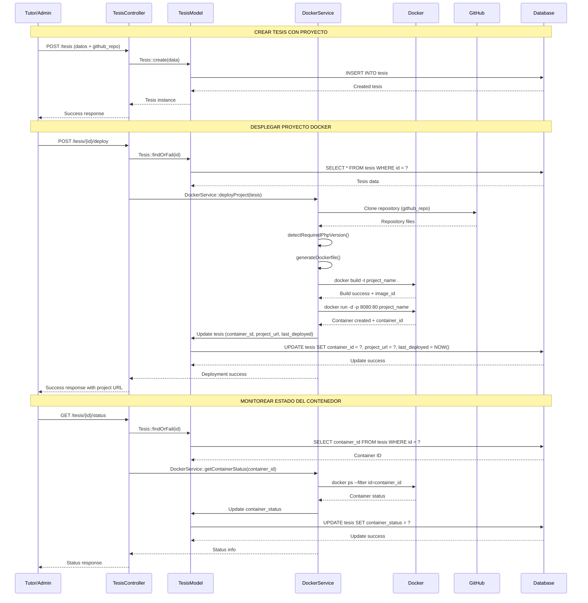
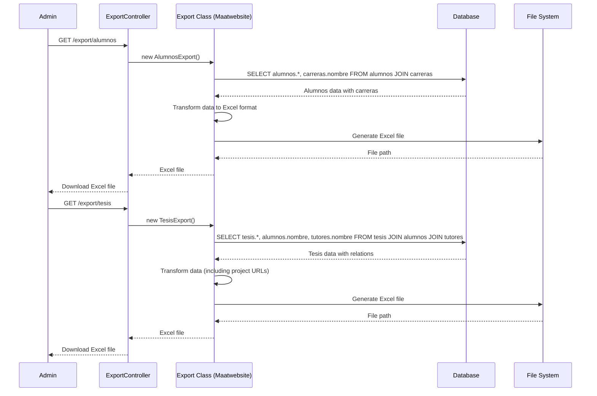
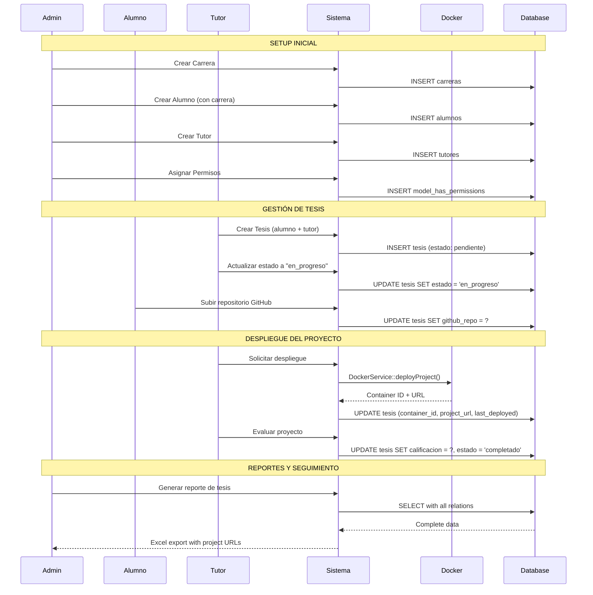

# 🔄 DIAGRAMAS DE SECUENCIA - SISTEMA DE TESIS

## 🔐 **1. PROCESO DE AUTENTICACIÓN Y AUTORIZACIÓN**



## 👨‍🎓 **2. GESTIÓN DE ALUMNOS (CRUD)**

```mermaid
sequenceDiagram
    participant A as Admin/Coordinador
    participant AC as AlumnoController
    participant V as Validator
    participant AM as AlumnoModel
    particle CM as CarreraModel
    participant DB as Database

    Note over A,DB: CREAR ALUMNO
    A->>AC: POST /alumnos (datos del alumno)
    AC->>V: Validate request data
    V-->>AC: Validation passed
    AC->>CM: Carrera::find(id_carrera)
    CM->>DB: SELECT * FROM carreras WHERE id = ?
    DB-->>CM: Carrera data
    CM-->>AC: Carrera exists
    AC->>AM: Alumno::create(data)
    AM->>DB: INSERT INTO alumnos
    DB-->>AM: Created alumno
    AM-->>AC: Alumno instance
    AC-->>A: Success response + redirect

    Note over A,DB: LISTAR ALUMNOS
    A->>AC: GET /alumnos
    AC->>AM: Alumno::with('carrera')
    AM->>DB: SELECT alumnos.*, carreras.nombre FROM alumnos JOIN carreras
    DB-->>AM: Alumnos with carrera data
    AM-->>AC: Collection of alumnos
    AC-->>A: Alumnos index view

    Note over A,DB: ACTUALIZAR ALUMNO
    A->>AC: PUT /alumnos/{id} (updated data)
    AC->>AM: Alumno::findOrFail(id)
    AM->>DB: SELECT * FROM alumnos WHERE id = ?
    DB-->>AM: Alumno data
    AC->>V: Validate updated data
    V-->>AC: Validation passed
    AC->>AM: $alumno->update(data)
    AM->>DB: UPDATE alumnos SET ... WHERE id = ?
    DB-->>AM: Update success
    AC-->>A: Success response

    Note over A,DB: SOFT DELETE ALUMNO
    A->>AC: DELETE /alumnos/{id}
    AC->>AM: Alumno::findOrFail(id)
    AM->>DB: SELECT * FROM alumnos WHERE id = ? AND deleted_at IS NULL
    DB-->>AM: Alumno data
    AC->>AM: $alumno->delete()
    AM->>DB: UPDATE alumnos SET deleted_at = NOW() WHERE id = ?
    DB-->>AM: Soft delete success
    AC-->>A: Success response
```

## 📚 **3. GESTIÓN DE TESIS Y PROYECTOS DOCKER**



## 📊 **4. EXPORTACIÓN DE DATOS**



## 🔄 **5. FLUJO COMPLETO: DE ALUMNO A PROYECTO DESPLEGADO**


